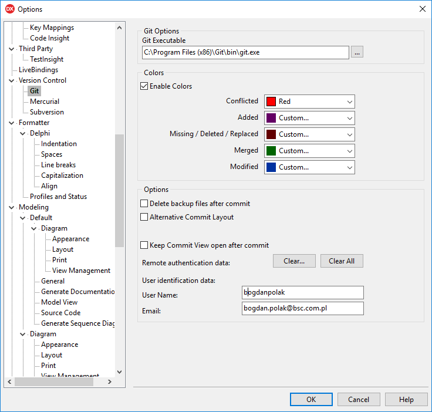
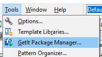

# Konfiguracja stanowiska

### Konfiguracja podana w wymaganiach do warsztatu (przypomnienie).

* Instalacja serwerów SQL
    1. Zainstalowanie i konfiguracja serwera InterBase lub Firebird (do wyboru jeden z nich)
    2. Stworzenie pustej bazy danych InterBase / Firebird
        * Artykuł w serwise reedit.com:
            * [serwer InterBase](https://www.reddit.com/user/BogdanPolakBSC/comments/9cymje/)
            * [serwer Firebird](https://www.reddit.com/user/BogdanPolakBSC/comments/9cyrh2/)
			```sql
			create database '<ścieżka do pliku fdb>' default character set UTF_8;
			```
    3. Dodanie definicji połączenia FireDAC do stworzonej w kroku powyżej bazy.
        * IB_MailingDB 
        * FB_MailingDB - Firebird
* Konto na Github
    * Sprawdzenie dostępu do aktualnego konta 
    * Założenie nowego konta na GitHub: https://github.com/join (niezbędne do pracy w czasie warsztatów)
    

### Dodatkowe kroki konfiguracyjne

1. Sprawdzenie czy połączenie jest Unicode-owe.
    * Ustawienie ```CHARACTER SET = UTF8``` w połączeniach FireDAC oraz w konsoli administracyjnej
    * Uruchomienie skryptu (menu [Tools] -> [FireDAC Explorer] lub [FireDAC Connection Editor] -> zakładka [SQL Script]:
        * [FireDAC Explorer](http://docwiki.embarcadero.com/RADStudio/Tokyo/en/Setting_up_Connections_(FireDAC)#Using_the_FDExplorer_Utility)
        * [FireDAC Connection Editor](http://docwiki.embarcadero.com/RADStudio/Tokyo/en/Setting_up_Connections_(FireDAC)#Using_the_TFDConnection_Design-Time_Editor)
        ```
        SET AUTOCOMMIT ON
        CREATE TABLE AAA (F1 VARCHAR(50) CHARACTER SET UTF8);
        INSERT INTO AAA VALUES ('Οὐχὶ ταὐτὰ παρίσταταί');
        SELECT * FROM AAA;
        DROP TABLE AAA;
        ```
    * Na konsoli powinny pojawić się greckie słowa z tabeli AAA.

2. **Klient Git dla Windows - instalacja**
    * Pobranie i instalacja Git dla Windows: https://git-scm.com/download/win
    * Zainstalowanie Manager'a autentykacji dla Git Windows: https://github.com/Microsoft/Git-Credential-Manager-for-Windows
        * Przydatny wtedy gdy konsola Windows "zapomina" dane logowania dla git-a.
        * Pobranie instlatora (EXE) ze strony: https://github.com/Microsoft/Git-Credential-Manager-for-Windows/releases/
        * Uruchomienie
		* Konfiguracja z linii poleceń
		```sh
		git config --global user.email "you@example.com"
		git config --global user.name "Your Name"
		```

4. **RAD Studio IDE**
    * Ustawienie opcji IDE:
        * Git Executable
        * Remote authentication data
        
    * Instalacja ChromeTabs przez GetIt:
        * menu: Tools -> GetIt Package Manager
    	* 

5. **Sklonowanie tego projektu**
    * Uruchomienie linii poleceń Windows - **CMD.EXE**
    * Przejście do folderu w którym mają być źródła projektu
        * polecenia: ```cd``` i ```dir```
    * ```git clone https://github.com/bogdanpolak/MailingListVCL.git```

6. Uruchomienie projektu w RAD Studio (Delphi)
    * Ustawienie w ```MainDataModule.pas```:
        *  ```FDConnection1.ConnectionDefName```:
            * **IB_MailingDB** - dla bazy Interbase
            * **FB_MailingDB** - dla bazy Firebird
        * Po uruchomieniu:
            * Button [Utwórz struktury w bazie danych] i w oknie [Uruchom skrypt]


***

### Na warsztatach

1. **Konsola Windows**
    * Skopiowanie pliku OpenConsole.bat z podfolderu assets do folderu głównego projektu

2. **Dostęp do Internetu**
    * Parametry WiFi:
        * [Golden Floor Tower - Warszawa] 
            * sieć: ```..```  
            * hasło: ```..```

3. **Dodanie aliasów git-a**
    * modyfikacja pliku pliku .gitconfig
        * Lokalizacja: C:\Users\{{użytkownik}}
        * dodanie poniższych aliasów:
        ```
        [alias]
        	graph1 = log --graph --abbrev-commit --decorate --format=format:'%C(bold blue)%h%C(reset) - %C(bold green)(%ar)%C(reset) %C(white)%s%C(reset) %C(dim white)- %an%C(reset)%C(bold yellow)%d%C(reset)' --all
        	graph2 = log --graph --abbrev-commit --decorate --format=format:'%C(bold blue)%h%C(reset) - %C(bold cyan)%aD%C(reset) %C(bold green)(%ar)%C(reset)%C(bold yellow)%d%C(reset)%n''          %C(white)%s%C(reset) %C(dim white)- %an%C(reset)' --all
        	lg = !"git graph1"
        ```
