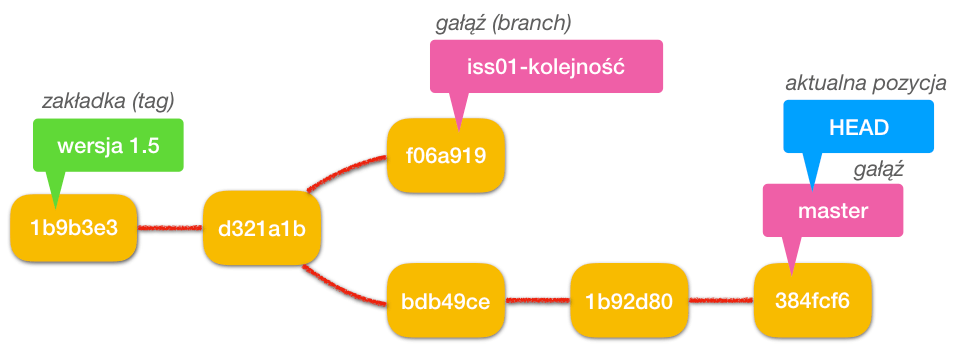
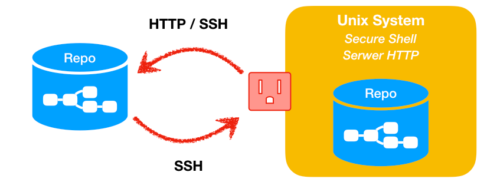
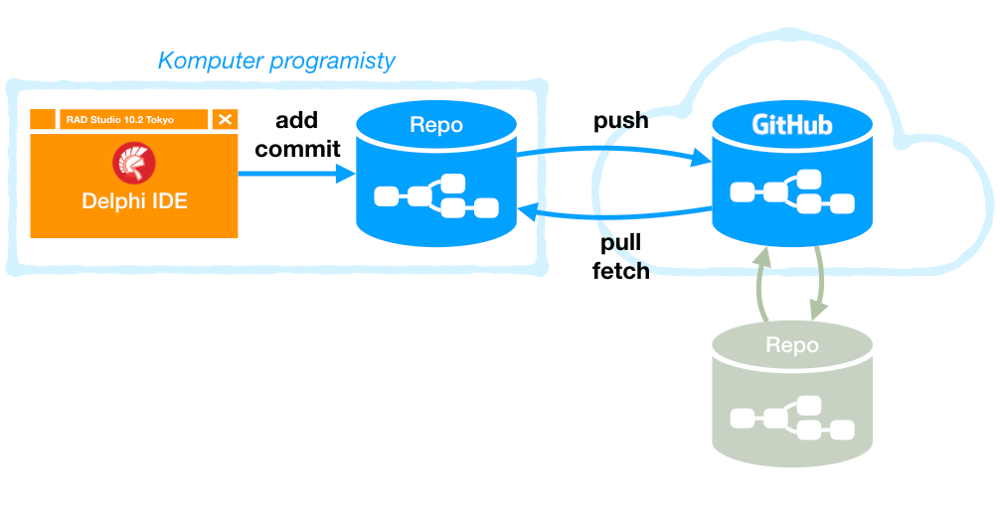
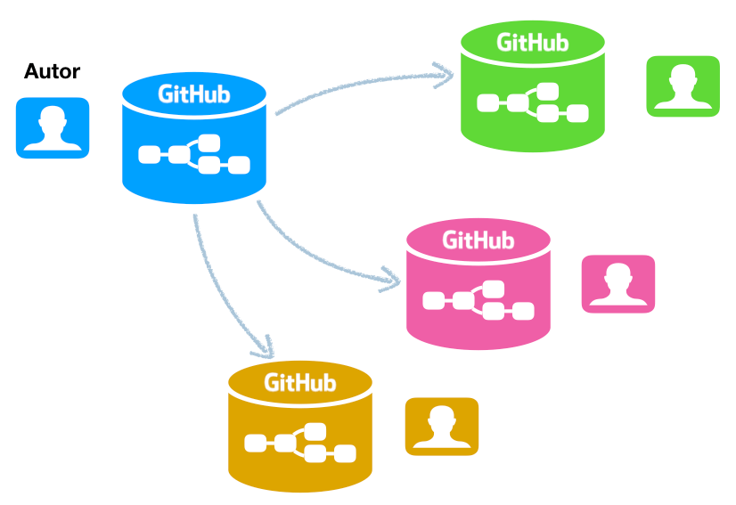

# Zostań Git-owcem

### Repozytorium Git-a



Repozytorium Git-a zawiera zbiór rewizji (wersji historycznych), a każda rewizja to zbiór migawek. Migawka zawiera w całości wszystkie zmienione lub nowo dodane pliki oraz wskaźniki do aktualnej wersji wszsytkich nie zmienionych plików. W efekcie repozytorium Git-a staje się bardzo wydajnym systemem plików z możliwością optymalnego zamiętania ich wcześniejszych wersji. Dzięki takiemu rozwiązaniu każda rewizja zawiera pełny obraz plików. Systemy wersjonowania kodu starszej generacji (takie jak Subversion i CVS)

Rewizja jest jest unikalnie identyfikowana 40 znakowym kodem SHA-1 (20 bajtów zapisanych heksadecymalnie). Unikalność identyfikatora rewizji jest zapewniona nie tylko w ramach lokalnego repozytorium, ale również globalnie w ramach wielu repozytoriów. Dla łatwiejszego odwoływania się do rewizji w praktyce stosuje się 7-znakowy skrót (pierwsze 7 znaków z 40 znakowego skrótu SHA-1).

Każda z rewizja połączona jest z poprzednią wersją (wskazuje ją). W efekcie możliwe jest aby jedna rewizja była wskazywana równocześnie przez kilka "nowszych" rewizji. Taką sytuację nazywa się rozgałęzieniem.

Pozostałe kluczowe obiekty w repozytorium Git-a to wskaźniki. Jest ich kilka rodzajów:

* **głowa (HEAD)** - aktualnie widoczna w katalogu roboczym rewizja. Głowa może wskazywać dowolną gałąź lub bezpośrednio którąś z rewizji. Każda zmiana (commit) powoduje utworzenie nowej rewizji i przesuniecie głowy

* **gałąź (branch)** - nazwany wskaźnik, który wskazuje dowolną rewizję w repozytorium. Gałąź aktualna to taka, którą wskazuje głowa. Przełączanie się miedzy gałęziami powoduje również aktualizację plików w katalogu roboczym. Jeśli głowa (HEAD) wskazuję gałąź to w momencie zmiany przesuwany jest ten wskaźnik gałęzi na nowo powstałą rewizję. Głowa nadal wskazuje na tą gałąź, czyli pośrednio zostanie "przesunięta".

* **gałąź główna (master)** - tworząc nowe repozytorium, automatycznie tworzona jest gałąź główna o nazwie master. Zazwyczaj wskazuje na aktualną zatwierdzoną wersję wersjonowanych dokumentów.

* **etykieta (tag)** - nazwany wskaźnik rewizji, w odróżnieniu od gałęzi nie przesuwa się w momencie wprowadzenia zmian, czyli stale wskazuje wybraną rewizję. Można ja wykorzystać to wskazania numeru wersji projektu.

***

### Zdalne repozytorium


Git jest rozproszonym systemem wersjonowania kodu źródłowego, czyli programista zazwyczaj korzysta ze swojej własnej kopii repozytorium głównego. Lokalne repozytorium jest w pełni autonomiczną kopią repozytorium Git-a. Dzięki takiemu rozwiazaniu mozliwe jest zatwierdzanie zmian bez połączenia sieciowego (sieć lokalna lub sieć Internet). Repozytorium lokalne tworzone jest na dwa sposoby: 
* poleceniem ```git init``` - powstaje puste repozytorium w katalogu, w którym wydano takie polecenie.
* poleceniem ```git clone [adres_repozytorium_zdalnego]``` - tworzone jest nowe repozytorium będące kopią zdalnego, w takiej sytuacji adres do repozytorium zdalnego zapamiętywany jest po skrótem, nazwanym domyślnie ```origin```.

Zmiany umieszczone w repozytorium lokalnym można w każdym momencie zsynchronizować z repozytorium zdalnym wydając poleceni ```git push```

***

### Delphi i GitHub


Środowisko Delphi zawiera integrację z Git-em nazywaną VersionInsight. Rozszerzenie to pozwala na wydawanie wielu poleceń git-a, choć w praktyce najlepiej sprawdza się w czasie dodawania zmian do repozytorium lokalnego

***

### Fork na GitHub


***

### PullRequest na GitHub


### Symulatory Git-a

Dwa przykłady z wielu (wystarczy poszukać):

1. Symulator z zadaniami oraz z wizualizacją w formie grafu
  * [Learning Git Branching](https://learngitbranching.js.org)
  * Ciekawe zadania pozwalające głębiej poznać pracę z gałęziami w Git-cie
  * Zadania w języku angielskim
  
2. Fajna wizualizacja na grafie do własnych eksperymentów
  * [Visualizing Git](http://git-school.github.io/visualizing-git/)
  * Dokładne odwzorowanie rewizji w Git-cie
  * Symulacja repozytorium lokalnego i zdalnego (origin)
