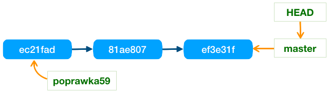

# Praca z gałęziami

Tematy opisane w ramach artykułu:
- [Zarządzanie gałęziami](#zarządzanie-gałęziami)
- [Przełączanie między gałęziami](#przełączanie-między-gałęziami)
- [Rozgałęzianie historii](#rozgałęzianie-historii)
- [Złączanie gałęzi](#złączanie-gałęzi)
- [Gałęzie zdalne](#gałęzie-zdalne)
- [Porządkowanie gałęzi lokalnych](#porządkowanie-gałęzi-lokalnych) 
- [Porządkowanie gałęzi zdalnych](#porządkowanie-gałęzi-zdalnych) **[[wersja robocza]]**

## Zarządzanie gałęziami

Do operacji pozwalających na zarządzanie gałęziami można zaliczyć:

1. Tworzenie gałęzi
2. Usuwanie gałęzi
3. Przesuwanie gałęzi

Do tworzenia oraz do zarządzania gałęziami służy głównie polecenie ```git branch```, aby dodać nową gałąź należy do tego polecenia dodać nazwę gałęzi, która musi być unikalna w ramach całego repozytorium. Przykładowe polecenie tworzące nową gałąź:

```
git branch poprawka59
```

Podobnie usunięcie gałęzi jest wykonuje się tym samym poleceniem dodając opcję ```-d``` lub ```--delete```, tak jak na poniższym przykładzie:

```
git branch -d poprawka59
```

Nie można w ten sposób usuwać gałęzi, które nie zostały scalona z resztą drzewa, czyli gdy ta gałąź nie zawiera się w historii innej gałęzi. Blokada ta wynika z faktu, że rewizje podczepione do takiej gałęzi mogą zniknąć z historii repozytorium po usunięciu jedynego wskaźnika do nich.

Jeśli w takiej sytuacji mimo wszystko chcemy usunąć taką gałąź to musimy dodać opcję `--force` lub `-f`, w skrócie można napisać `-df` lub jeszcze krócej `-D`:

```
git branch -D poprawka59
```

W strukturach repozytorium gałąź jest obiektem, który wskazuję na aktualną rewizję, z kolei ta rewizja wskazuje na wcześniejszą rewizję (wersję) itd. Czyli struktura przykładowego repozytorium z jedną gałęzią `master` mogłaby wyglądać w ten sposób:


Wskaźnik ```HEAD``` to bieżące miejsce, czyli miejsce w które są wstawiane nowe zmiany `git commit` oraz gdzie wykonywane są inne bieżące informacje, takie jak `diff` i wiele innych.

Usuwając gałąź do repozytorium lub dodając ją robimy tylko prostą operacje usunięcia lub dodania nowego obiektu wskazującego pewną wersję. Bardzo ważne, że do jej ukończenia nigdy nie trzeba przebudowywać aktualnej struktury repozytorium.

Równie łatwo jak dodawać/usuwać można także przesuwać gałąź na aktualną rewizję (`HEAD`). Spójrzmy na przykład:



Gałąź `poprawka59` ustawioną jest na wcześniejszej rewizji, jeśli chcemy ją przestawić na aktualne miejsce to możemy usunąć gałąź i od razu ją dodać:

```
git branch -d poprawka59
git branch poprawka59
```

Dla uproszczenia operacji można zignorować wszystkie ostrzeżenia i dodać już istniejącą gałąź z opcją ```-f``` lub ```--force```:

```
git branch -f poprawka59
```

W wyniku wywołanych poleceń przesuniemy gałąź na bieżącą wersję w historii rewizji:


## Przełączanie między gałęziami

Przełączenie między gałęziami wykonuje polecenie ```git checkout```. Gałąź na którą chcemy się przełączyć podajemy jako parametr:

```
git checkout poprawka59
```

Po wykonaniu tej operacji, głowa ```HEAD``` zostanie przestawiona na gałąź ```poprawka59```, czyli bieżące operacje będą wykonywane w tym miejscu: 


Po zatwierdzeniu zmian zostanie utworzona nowa rewizja, a wskaźnik gałęzi przesunięty na nią:


Kolejne przełączenie się na gałąź ```master```, spowoduje, że w plikach roboczych znikną wprowadzone wcześniej zmiany. Wywołujemy:
 
```
git checkout master
```

Głowa zostaje przełączona na gałąź ```master```, a pliki znajdujące się katalogu roboczym zostana zmodyfikowane tak, aby wyglądały tak jak wcześniej, czyli przed wprowadzoną zmianą. Jednak zmiany nie znikają na stałe, ponieważ są już utrwalone w repozytorium i każdej chwili można się na nie przełączyć wywołując polecenie ```git checkout poprawka59```

Polecenie ```git checkout``` pozwala przełączyć ```HEAD``` na dowolną rewizję w repozytorium (nie tylko na którąś z gałęzi). W tym celu musimy znać identyfikator wersji lub jego skróconą wersję (7 znaków). Patrząc na przykłady podane wcześniej widać, że jedna z wcześniejszych rewizji identyfikowana jest skrótem: ```81ae807```. Przełączając się w takie miejsce powinniśmy równocześnie utworzyć nową gałąź w tym miejscu, aby nie otrzymać tzw. odczepionej głowy. Do utworznia nowej gałęzi służy opcja ```-b```:

```
git checkout b8f9e20 -b eksperymencik
```

Jeśli gałąź może już istnieć to trzeba ją przestawić na bieżące czyli zresetować. Można to zrobić przy pomocy opcji ```-B```. Tak jak w przykładzie:

```
git checkout -B patchBP
```

Co jest równoważne poleceniom:

```
git branch -f patchBP
git checkout patchBP
```

## Rozgałęzianie historii

Gałąź w Git to lekki obiekt (ma niewielki rozmiar), który wskazuje na najnowszą zmianę (rewizję). Wprowadzając zmianę raz w jednej gałęzi, a następnie w drugiej możemy rozgałęzić historię rewizji naszego repozytorium.

Git podobnie jak każdy system wersjonowania plików pozwala rozgałęziać historię, co ważne w tym systemie jest to wyjątkowo lekka i bardzo bezpieczna operacja. Co zachęca do jej częstego używania. W systemach starszej generacji takich jak ```CVS``` lub ```Subversion``` jest to bardzo ciężka operacja, którą można używać tylko w niezbędnych sytuacjach.

W systemie Git rozgałęzienie polega na stworzeniu w strukturach repozytorium nowego obiektu - gałęzi, który wskazuję aktualną rewizję. Gałąź nie tworzy kopii swojej własnej historii i działa lokalnie, dzięki czemu jest wykonywana błyskawicznie.

Aby rozgałęzić historię wystarczy przełączyć się na gałąź ustawioną gdzieś na starszej niż aktualna rewizji w historii repozytorium i zatwierdzić zmianę.


## Złączanie gałęzi

Zapewne w krótkim czasie po rozgałęzieniu historii konieczne okaże się jej złączenie, aby lepiej na czym polega rozstrzyganie konfliktów podczas scalania gałęzi rozpatrzmy opisany dalej scenariusz.

Wcześniej stworzyliśmy gałąź ```poprawka59``` przeznaczoną do przygotowania łatki dla błędu nr 59. Przyjmijmy, że do zrealizowania tego zadania potrzebne były dwie rewizje (na diagramie poniżej są to rewizje ```6ede961``` oraz ```51e7151```). Teraz chcemy scalić te zmiany z gałęzią główną, ale w między czasie pojawiła się w niej nowa rewizja (```f3137c0```). Niestety zwykłe przepisanie zmian do gałęzi głównej ```master``` nie jest możliwe, ponieważ modyfikowane były te same pliki w obu gałęziach. W takiej sytuacji musi dojść do trójstronnego scalenia.


Polecenie ```git merge``` informuje system o potrzebie scalenia aktualnej pozycji (```HEAD```) ze wskazaną jako parametr gałęzią. 

```
git merge poprawka59
```

Wróćmy do opisanej wcześniej i rozrysowanej na diagramie sytuacji. Znajdujemy się na gałęzi ```master```, którą próbujemy scalić z gałezią ```poprawka59```. Po wydaniu powyższego polecenia, system najpierw odszuka ***wspólnego przodka*** i ustali, że doszło do rozgałęzienia. Również ustalone zostaną zmiany wprowadzone w obu gałęziach, czyli mamy 3 wersje zaangażowane w proces scalania (oznaczone na żółto na powyższym diagramie). Po weryfikacji różnić w tych trzech miejscach system ustali czy scalenie może zostać wykonane automatycznie. 

Jeśli zmienianie były różne pliki w obu gałęziach to łatwo można złączyć wszystkie zmiany. Również jeśli obie gałęzie zmieniały ten sam plik, ale w różnych miejscach (różnych liniach) to również można połączyć wszystkie zmiany automatycznie. Jednak jeśli w obu gałęziach zmieniono tą samą linie to wtedy mamy konflikt, który musi rozstrzygnąć użytkownik.

> **TODO:** Wytłumaczyć jak działa merge i kiedy trzeba go używać (wspomnieć o przepisywaniu historii jako rozwiązaniu alternatywnym)

## Gałęzie zdalne

W historii repozytorium poza wskaźnikami jakimi są gałęzie mogą występować zupełnie innego typu wskaźniki. Są one pobrane ze zdalnych repozytoriów przy pomocy operacji ```fetch``` lub ```pull```. W czasie powyższych operacji są pobierane informacje o pozycji gałęzi w zdalnym repozytorium. 

Ta sama gałąź może wskazywać zupełnie inną rewizję w repozytorium lokalnym i inną zdalnym. Stąd gałęzie zdalne są nazywane z dodaniem jako prefiksu nazwy zdalnego repozytorium, czyli: {nazwa repozytorium}/{nazwa gałęzi}, na przykład: ```origin/master``` lub ```jankowalski/master```.

Należy unikać nazywania gałęzi lokalnych nazwami w takim formacie, czyli lepiej w ogóle nie używać znaku ```/``` w nazwach gałęzi lokalnych, aby nie wprowadzać w błąd mniej doświadczonych użytkowników.

Gałęzie zdalne są traktowane zupełnie inaczej niż gałęzie lokalne i zachowują się podobnie jak etykiety (tags). W efekcie nie można, na przykład, przełączyć ```HEAD``` na taką gałąź. Czyli po wywołaniu poniższego polecenia głowa zostanie przełączona na rewizję wskazywaną przez gałąź zdalną, ale będzie wskazywała bezpośrednio tą rewizję, a nie gałąź ```origin/master```.

```
git checkout origin/master
```

Dostajemy następującą sytuację, czyli odłączoną głowę.


Nie jest to zalecany stan i raczej powinno się unikać sytuacji gdy głowa nie wskazuje jednej z lokalnych gałęzi. Jeśli potrzebujemy wykonywać zmiany na tym miejscu to taką operację ```git checkout``` powinniśmy wykonać z opcją ```-b```, dodając nową gałąź.

Już wspomniałem wcześniej jak są aktualizowane pozycje wskaźników zdalnych, 

Pozycje gałęzi zdalnych są aktualizowane w zdalnym repozytorium w momencie wysyłania tam zmian, czyli podczas operacji ```git push```. W takiej sytuacji pozycja gałęzi zdalnej jest aktualizowana zgodnie z pozycją gałęzi lokalnej, pod warunkiem, że nie ma konfliktów z aktualną pozycją tej gałęzi na serwerze. Jeśli taki konflikt wystepuje to cała operacja jest uznawana za niebezpieczną i system odmawia jej wykonania. Gdy chcemy ją wykonać mimo wszystko to trzeba ją wymusić opcją ```-f```, tak jak w przykładzie:

```
git push -f origin master
  # origin = zdalne repozytorium
  # master = gałąź
```

Choć czasami wykonanie takiej operacji jest konieczne to jednak lepiej jej unikać, aby nie utrudniać życia innym użytkownikom repozytorium. Zasadniczo nie należy tego robić na repozytoriach współdzielonych przez kilku programistów. Zawsze można złączyć obie gałęzie

Tak samo informacje o gałęzi zdalnej se pobierane podczas wykonania operacji:

```
git pull origin master
```

## Porządkowanie gałęzi lokalnych

Lista gałęzi scalonych z gałęzią główną (master) 
```
git branch --merged master 
```
Lista gałęzi scalonych z HEAD, czyli z głową bieżącej gałęzi
```
git branch --merged 
```

Lista gałęzi **niescalonych** z HEAD (j.w.)
```
git branch --no-merged
```

## Porządkowanie gałęzi zdalnych

Aktualizacja zapamiętanej lokalnie listy zdalnych gałęzi w śledzonych zdalnych repozytoriach (```prune cache```)

```
git fetch -p origin
git fetch --prune origin
```

Angielski opis z dokumentacji ```fetch --prune```

> ```Before fetching, remove any remote-tracking references that no longer exist on the remote. Tags are not subject to pruning if they are fetched only because of the default tag auto-following or due to a --tags option. However, if tags are fetched due to an explicit refspec (either on the command line or in the remote configuration, for example if the remote was cloned with the --mirror option), then they are also subject to pruning```

Tworzenie gałęzi lokalnej na bazie gałęzi zdalnej

```
git checkout --track origin/poprwka61
```


Lista gałęzi lokalnych i zdalnych
```
git branch --all
git branch -a
git branch --remote
git branch -r
```

Kasowanie gałęzi zdalnej

```
git push origin --delete pg-branches-v1
```

Wersja skrócona:

```
git push origin :pg-branches-v1
```
